# 小作文

- 题型分类
    - 图表（最常考）：折线图 line graph 柱状图 bar chart 饼图 pie chart 表格 table
        - 动态图：包含多个时间点，可以描述 **变化趋势 change**
        - 静态图：没有或只有一个时间点，可以 **比较数据 difference**
    - 流程图
    - 地图
- 题目要求
    
    Summarize the information by selecting and reporting the main features, and make comparisons where relevant.
    
    **需客观、准确、全面地描述，不能主观**
    
    features: 特征，指图表中所有可以看到的内容，包括数据的含义、所属、时间和具体的数值
    
    report: 要求描述图表中的数据
    
    select: 通过 make comparisons 的方式 select
    
    比较的三个纬度
    
    - 数值方面（最大值、最小值、等值、差值、倍数、大于、小于）
    - 趋势方面（对于动态图）（上升、下降、波动、稳定）
    - 幅度方面（剧烈、平缓）

# 图表类

## 段落

### 段落组成

固定包含四段

- **第一段：改写段**
对图表介绍进行复述、同义改写，1~2 句话，题目中图表介绍是几句话就写成几句话
- **第二段：Overview 段**
2~3 句话，2~3 个要点，包含宏观信息，“看型”不能碰任何具体数值，引导词：**Overall, In sum**
- **第三段和第四段：Detail 段**
各 4~5 句话 main features，需要描述微观信息，注意把具有相似性的内容分为一组，共两组

---

具体细节

### 改写段

改写规则

- 换词（占 ≤20%）
    
    the graph → 更具体的类型
    
    shows → illustrates, compares, displays
    
    proportion → percentage
    
    information → data
    
    number → figure
    
    types → categories
    
    trends → changes
    
- 换位置（1~2组）
    
    后置定语 → 前置修饰语
    
    句中状语 → 句前/句末状语
    
- 概括
    
    国家名 → three countries
    
    时间 → three years between... and.
    

注：如果题目中对两张图表有两句话介绍，则分别改写这两句话

### Overview 段

包含宏观信息，**“看型”** 而 **不能碰任何具体数值**

- 例一（line graph 动态图）
    
    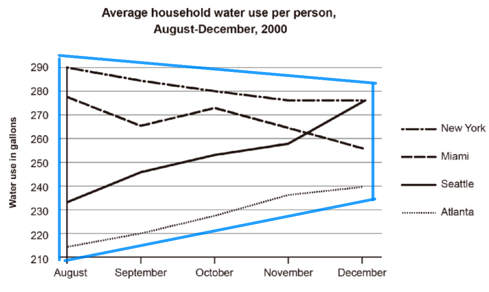
    
    看型：左宽右窄，两升两降
    
    注：过去的时间点，一般过去时即可
    
    左宽右窄：**In sum**, there was a large gap between the numbers for each city in August, while by December, the difference narrowed.
    
    两升两降：Between August and December, New York and Miami had a general decline in household water use per person, whereas Seattle and Atlanta saw an increase.
    
- 例二（bar chart 静态图）
    
    
    
    看型：灰高于黑、右高于左
    
    注：这是静态图，不能用描述数据趋势的表达（随着……越来越……）
    
    ① 灰高于黑：**Overall**, the proportion of women with more than one chronic disease was lower than that of men in the same age group.
    
    ② 右高于左：**Also**, older people were at a higher risk of developing chronic diseases than younger people.
    
- 例三（pie chart 动态图）
    
    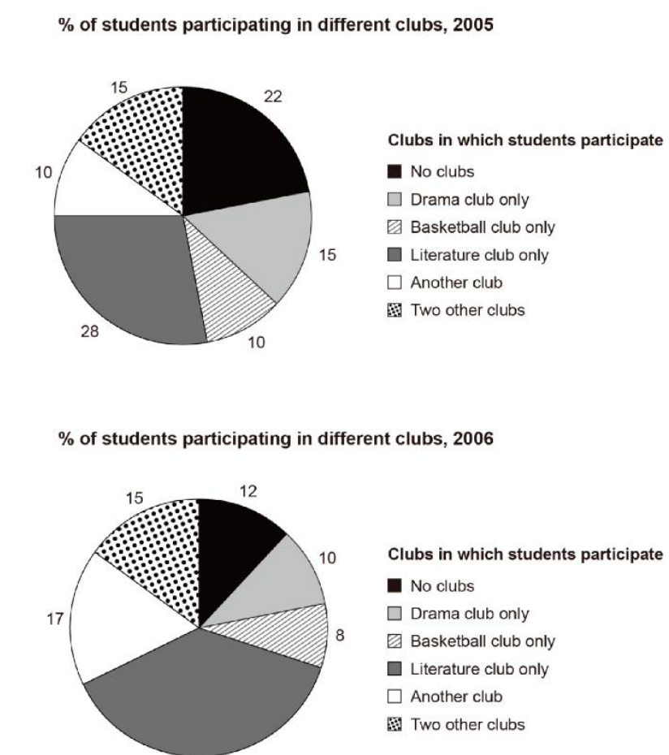
    
    **In sum**, the percentage of students at this university who participate in two other clubs remained stable over the two years.
    
    选择 Two other clubs 的学生比例在两个年份中是相对稳定的。
    
    There have been changes in the percentage of students opting for other clubs or none at all.
    
    选择其他 Clubs 或没有选择任何 Clubs 的学生比例在两个年份中都有一定的变化。
    
- 例四（table 静态图）
    
    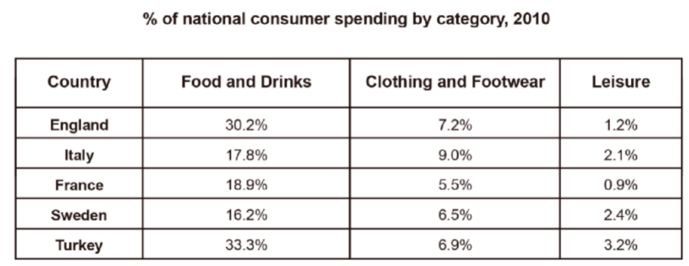
    
    > **看型**而不能碰任何具体的数值
    > 
    
    **Overall**, for these five countries, the proportion of consumption on food and drinks is the largest; the smallest part, on the contrary, is on leisure.
    
    五个国家在 Food and Drinks 上消费占比都是最大的；而在 Leisure 方面的消费最小
    

### **Detail 段**

**对数**

- 所有 main features 的准确数值
- 极值/等值，起点/终点，最高点/最低点，升幅/降幅

通过把具有相似性的内容分为一组，将细节性信息分成 2 组 → 两个 detail 段

细节段的划分方式（如何划分两个段落）：

- **时间维度**
    
    10 月之前如何，10 月之后如何
    
    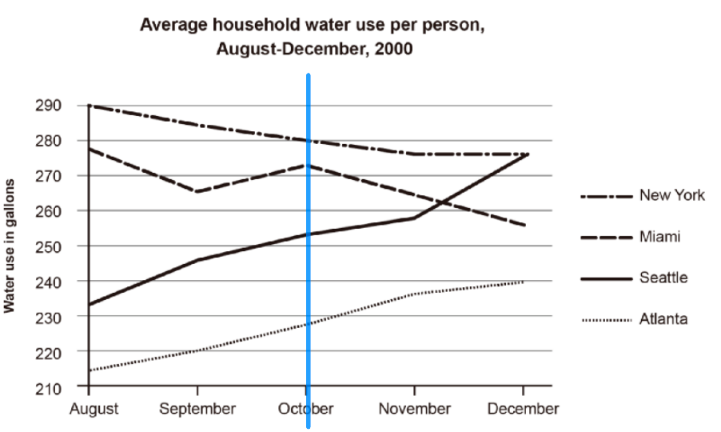
    
- **排名纬度**
    
    描述中美两国的情况，描述其余国家（3~10）的情况
    
    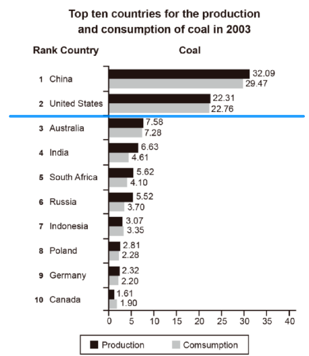
    
- 比较对象本身特点
    
    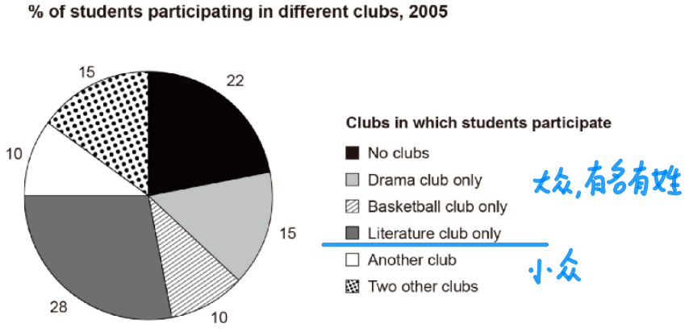
    
- 比较对象纬度特点
    
    两个比较的维度 ① 性别 ② 年龄段
    
    ① 男性内部不同年龄段的对比；女性内部也是如此
    
    ② 每一个年龄段，男性与女性之间的交叉对比
    
    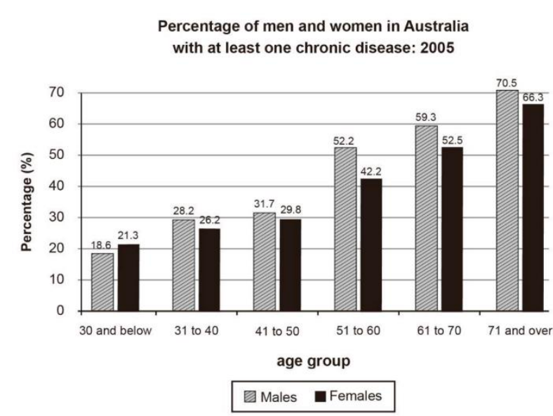
    
- 图表均有的题目
    
    一张图/表对应一个 detail 段 → 恰好两个 detail 段
    

**细节段引导词**

- As for X … Concerning Y …
- As shown in the first chart … As shown in the second chart …
- According to the … Based on the …
- Similarly, Likewise, By contrast, By comparison, On the other hand

## **注意事项**

### 时态

一般：混用多种时态

- 对图表的整体描述 → 一般现在时 the line graph illustrates ...
- 对图表的数据描述 → 数据发生的具体时间
    - 已发生 / 正在进行 / 即将上演 →  一过 / 一现 / 一将
- 趋势（到某个时间点为止，某数据的状态一直是）：完成进行时
    - 过去：过去完成进行时 had been doing
    某个数据直到 1999 年为止一直是上升的
    The figure **had been increasing** steadily till **1999**.
    - 现在：现在完成进行时 have been doing
    某个数据到现在为止一直是上升的
    The figure **has been growing** steadily by **now**.

注：若图表中没有任何具体时间 → 一现

### **逻辑连接词**

要求客观，不能主观：因果✗ 举例✗  递进✓  类比✓  转折✓  对比✓

并列关系: in addition, moreover, furthermore...

类比关系: similarly, likewise...

转折/对比关系: while, whereas, on the other hand, by contrast, on the contrary, but, however...

### 数据对象词

数据对象词指的是表达数据主观内容的词

对数据对象词的简化方法（必须保证数据对象词的**核心词**不变）：

- 省略：可省略修饰语，但必须保留核心词
- 指代：This/That/These/Those… 替代，指代必须指向核心词
- 例子：平均车辆二氧化碳排放量
    
    下图呈现了五个国家在 1990 年和 2000 年之间，平均每一个车辆的二氧化碳排放量。
    
    The graph below shows average carbon dioxide (CO₂) emissions per vehicle…
    
    限定修饰语：average carbon dioxide … per vehicle
    
    **核心词：emissions**
    
    ---
    
    描述：英国 1990 年的 X 是大于日本1990年的 X 的
    
    ✓ The average carbon dioxide emissions per vehicle in the UK in 1990 were greater than the average carbon dioxide emissions per vehicle in Japan.
    
    ✗ The average carbon dioxide emissions per vehicle in the UK in 1990 were greater than Japan.
    
    ✓ The average carbon dioxide emissions per vehicle in the UK in 1990 were greater than those in Japan.
    
    ---
    
    描述：英国平均每一个车辆的二氧化碳排放量在上升
    
    The average carbon dioxide emissions per vehicle in the UK steadily increased.
    
    描述：日本平均每一个车辆的二氧化碳排放量在下降
    
    省略（要保留核心词）
    
    The emissions in Japan steadily decreased.
    
    指代（指向核心词）（注 emissions 本身是复数，但是其数量是一个单数）
    
    Those of Japan steadily decreased.
    
    This figure for Japan steadily decreased.
    

## **高分要点**

### **语言使用**

如何从语言组织方面，提升整体图表类“小作文”写作质量

上升趋势

- 上升： rise = increase = grow = climb = jump = skyrocket
- 轻微上升: a slight increase = increase slightly
- 迅速上升: rapid growth = increase more rapidly
- 显著上升: a dramatic increase = increase dramatically
- 匀速上升: increase uniformly = increase constantly
- 持续上升: increase continuously
- 小增长: see a small rise to
- 涨到峰值: climb to its peak at = reach its peak at

下降趋势:

- 下降： decrease = decline = fall = drop = slide = plummet
- 轻微下降: a slight decrease = decrease slightly
- 显著下降: a significant decline = decline noticeably
- 持续下降: fall consistently
- 骤降: plummet to
- 呈现下降趋势: witness a downward trend

稳定趋势:

- 无变化: remain
- 保持: remain stable = steady = constant = uncharged
- ... remained relatively stable = remain uncharged at around... 相对保持稳定
- There is relatively little change in the figure for... ……的数字变化较小
- The number of A remained steady/stable from (month/year) to (month/year). ……月(年)至……月(年)的数量基本不变
- The percentage of A stayed the same between...and... ……至……期间 A 的比率维持不变
- The percentage remained steady at… 比率维持在……
- over the period from...to..., A remained level 从……年到……年的期间，A 保持不变

波动趋势:

- 波动: fluctuate = up and down
- 从某年开始波动: the number of (主体) fluctuated after (年份)
- 先升后降: the figure rose to (数值) in 2000 but fell again by (数值) in 2005. 2000年的数值上升到了……，但 2005 年又下降到……

超过:

- 超过: overtake
- A overtook B as the primary... A 超过 B
- The year 2008 marks the point at which A overtook that for B 相交后超过
- A decreased year by year, while B increased steadily. A 逐年减少，而 B 逐步上升

相同趋势:

- The upward/rising trend was also seen in A 上升趋势也见于 A
- The similar pattern can be seen ... 相似的情况在……上也能看到
- The same proportion of A is in... A 的同样比例也能在……中看到

相反趋势:

- The opposite trend can be seen when we look at (主体) ...
- However, there was a different trend for (主体)
- A way the only figure which + 上升/下降 A 是唯一与其他相反的趋势，呈……趋势
- The trend for A was noticeably different from those described above A 的趋势与上面描述的其他明显不同

预测趋势:

- 题中带预测或图中有未来年份的数据时:
- Looking into the future, A is predicted to / is likely to / is expected to... 看未来的趋势， A 预计/可能会上升/下降
- By+未来年份, it is thought that... 到……年，认为……的趋势会……

常用程度副词:

- 轻微: slightly = slowly = steadily = moderately
- 显著: noticeably = considerably = significantly = markedly
- 非常显著: dramatically = sharply = radically
- 连续不断地: continuously = all the way
- 表示大约（在具体数值前加）: close to = around = about = almost = nearly = approximately

### **内容组织**

内容组织即“结合”，将 2~3 个要点结合成一个 主句 + 辅句

具体四种方法

- 前后结合：先描述数据的前一部分，再描述后一部分
    - 纽约的人均用水量，从8月的290加仑降至11月的275加仑，然后在后续时间里，一直稳定在这个水平上。
    - The average household water use per person in New York saw a decrease from 290 gallons in August to about 275 gallons in November, and this figure remained at such a lower level in the rest of the period.
- 动静结合：静（数据点）动（数据的前后变化，即动态的趋势）
    - 在迈阿密，虽然人均用水量，在10月达到了第二次高峰（超过270加仑），但是，这个数据随后经历了连续两个月的下降。
    - In Miami, the average household water use per person reached a second peak in October with slightly over 270 gallons, but this figure recorded a two consecutive months of decline thereafter.
- 文理结合：文（给出评价）理（给出数值本身）
    - 亚特兰大是最节省用水的城市，人均用水量的最高值不超过240加仑。
    - Atlanta has been ranked as the most water-efficient city for households, with a maximum value of no more than 240 gallons.
- 宏微结合：微观片段 → 将数据放在宏观整体下比较
    - 西雅图人均用水量，从8月的235加仑增长至12月275加仑，从第三名升至第一名。
    - The average household water use per person in Seattle increased from 235 gallons in August to 275 gallons in December, moving from one of the two lowest to the number one city.

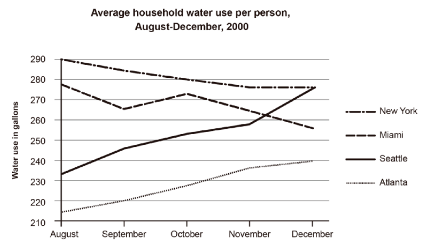

### 范文

- **动静结合**图范文
    
    The chart below shows how frequently people in Australia went swimming between 2001 and 2003.
    
    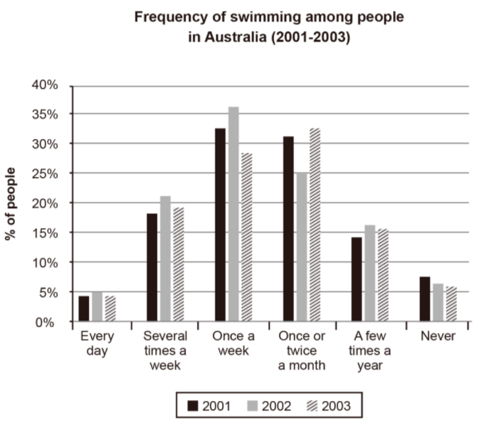
    
    柱状图，动态图 + 静态图两个纬度，Detail 段可以 1. 静态纬度 2. 动态纬度
    
    > 第一段
    > 
    
    The bar chart illustrates the frequency with which people swam in Australia between 2001 and 2003.
    
    含义一致 文字表达和组织顺序有改变
    
    > 第二段
    > 
    
    In sum, the proportion of people who swam irregularly weekly and monthly was the highest.
    
    每周和每个月不定期游泳的人数占比是最高的。（静态角度）
    
    As for those who swam with different frequencies, the trends varied from 2001 to 2003.
    
    在不同游泳频率的人群中，各个年份之间的变化趋势均有不同。（动态角度）
    
    > 第三段
    > 
    
    写**静态**纬度，年份✗  趋势✗  差异✓
    
    Of these, the largest group was those who swam at least once a week, with an average percentage of over 25% and a peak of over 35%.
    
    每周游泳1次占比比较高，均超过25%，最高超过35%。
    
    The percentage of people who swam once to twice a month was also high, with the lowest measurement being only 25%.
    
    每个月游泳 1-2 次占比也较高，最低时超过25%。
    
    At the same time, 15% to 20% of the population swam several times a week or several times a year, while only about 5% of people swam every day or never swam at all.
    
    每周游泳多次或每年游泳几次占比均在15%-20%，而每天都游泳或从来不游泳只占5%左右。
    
    > 第四段
    > 
    
    写**动态**纬度，年份✓ 差异✓
    
    In 2002, there was a large increase (about 5%) in the percentage of people who swam once a week and a considerable decline (more than 5%) in the percentage of people who swam once or twice a month.
    
    每周游泳多次及每周游泳1次，均在2002年，出现较大增加（5%左右）；相反，每个月游泳1-2次，在2002年，出现明显下降（超过5%）。
    
    During these three years, there was relatively little variation in the percentage of people who swam daily or several times a year, fluctuating only by 1 to 2%.
    
    每天游泳及每年游泳几次，在3年之间变化不大（1-2%左右）。
    
    Of the trends monitored, only the percentage of those who never swam showed a continuous downward trend throughout the course of the three years.
    
    只有从来不游泳，在三年之中，呈现持续下降趋势。
    
- **饼表结合**图范文
    
    The chart below shows what Computer Science graduates from one university did after finishing their undergraduate degree course. The table shows the salaries of the Computer Science graduates working after five years.
    
    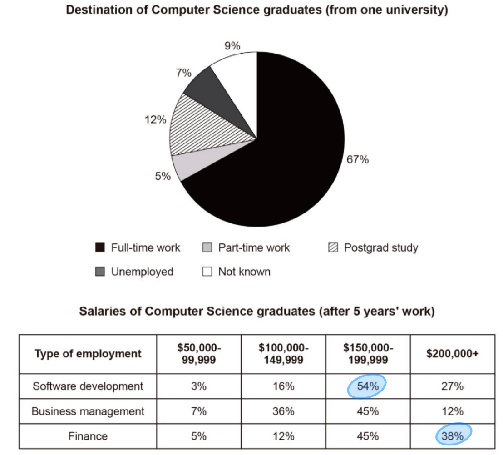
    
    饼表结合图，**静态图**，Detail 段可以 1. 饼图 2. 表格
    
    > 第一段
    > 
    
    The pie chart compares the post-graduate activities of Computer Science
    majors after completing their undergraduate degree program. Meanwhile,
    the table displays the salaries of Computer Science graduates after five
    years of employment.
    
    > 第二段 看型
    > 
    
    Overall, the vast majority of graduates work full-time. And most graduates
    have high salaries.
    
    > 第三段 对数 [静态图] 差异✓ 趋势✗
    > 
    
    According to the pie chart, the largest proportion of Computer Science
    graduates are in full-time employment, at 67%. Meanwhile, the percentage
    of graduates who go on to pursue post-graduate study is the second highest,
    at 12%. Less than 10% of graduates are working part-time, unemployed, or
    unknown (5%, 7%, and 9%, respectively).
    
    > 第四段 对数 [静态图] 差异✓ 趋势✗
    > 
    
    Based on the table, Computer Science graduates with salaries of $50,000-
    $99,000 is the least represented in all three occupations (software
    development, business management, and finance), as these workers account
    for less than 10%. Graduates with salaries of $150,000-199,000 make up
    the highest percentage (all over 40%), with software development
    representing the highest number of earners at 54% of this proportion.
    However, for the salary ranges of $100,000-$149,000, the three sectors differ greatly, with business management accounting for 36% and finance only 12%. The finance sector has the highest percentage (38%) of graduates in the highest salary range.
    

## **流程图类**

### 简介

分类：工序流程图、植物生长过程图

写作要求：逐一地、按顺序分别描述流程图中所表示的每一个步骤的情况

时态：表示时间和动作状态的语法现象

语态：主动语态/被动语态

- 工序流程图：被动语态，一般现在时
- 植物生长过程图：主动语态、一般现在时

### 段落

- 改写段：1~2 句话
- 细节 Detail 段：两个细阶段，各 5~6 句话
- 总阶 Overview 段：1~2 句话

### 高分要点

- 保证内容完整性
    - 宏观角度：完整写作所有的“步骤”或“环节”
    - 微观角度：对图中可见的细节进行文字化的体现
- 变化表达方式，产生多样性
    - 第一步：Initially… + 主句
    - 第二步：The following stage…
    - 第三部：Entering the final phase…
- 合并步骤描述，形成长句
    - First …, followed immediately by …

### 范文

The two diagrams show the soybean growth stages and the steps in the production of soy milk.

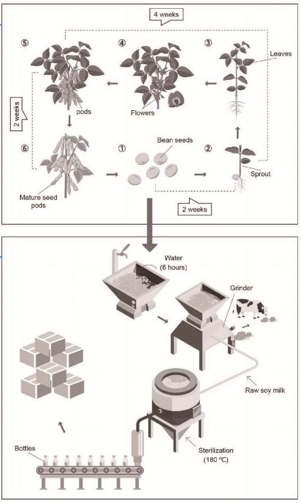

> 第一段
> 

The two diagrams illustrate stages of soybean growth and the production of soy milk, respectively.

> 第二段 第一张图：植物生长过程图，主动，一现
> 

During the growth of soybeans, first, after the soybean seeds are placed in the soil, they grow into sprouts in about 2 weeks.

在黄豆的生长过程中，首先黄豆种子在2周左右会长成树芽。

In the next phase, the sprouts gradually produce more leaves and flowers, which then transform into pods.

接着，树芽会逐渐长出更多的叶子并开花，然后花会逐渐接成豆荚。

The entire process of transitioning from sprout to pod takes about 4 weeks.

从树芽到结出豆荚的过程大约需要4周左右的时间。

Entering the final phase, the pods mature in 2 weeks and yield soybeans.

豆荚经过2周成熟后得到黄豆。

> 第三段 第二张图：工序流程图，被动，一现
> 

In the process of making soy milk, soybeans are first soaked in water for about 6 hours, and then the soaked soybeans are grounded, from which the raw soy milk is obtained.

在豆浆的制作过程中，黄豆会首先被浸泡在水中6小时左右，然后浸泡后的黄豆会被研磨并得到生豆浆。

Notably, the ground soybean residue left over from this process can be used to feed livestock.

研磨后的豆渣可以用来饲养牲畜。

Next, the raw soy milk is heated to 180 degrees to ensure sterilization.

接着，生豆浆会被加热至180度进行消毒。

In the final stage, the soy milk is bottled and packaged for distribution.

最后，豆浆会被装罐并打包。

> 第四段 总结
> 

In total, it takes 6 phases (about 8 weeks) to grow soybeans, while the soy milk production process is much faster, requiring only 4 steps.

## 地图

### 简介

对地图上重要的信息进行描述并比较

- 选址类
    - 地图：提供针对某一个建筑的两个不同的选址
    - 要求：首先对两个选址的基本情况进行描述，再选择一个更优的选项
- 变化类
    - 地图：两张图分别提供一个地区两个时期的情况变化
    - 要求：分别对两个时期地图中呈现的不同状况进行完整的描述

### 段落

- 改写段：1~2 句话
- 细节 Detail 段：两个细节段，各 5~6 句话
- 总阶 Overview 段：1~2 句话

### 范文

- 地图
    
    The two maps below show a seaside area, before and after the construction of some tourist facilities.
    
    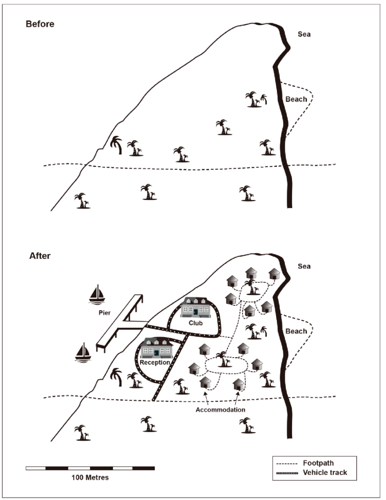
    
    > 第一段
    > 
    
    The two maps illustrate the transformation of a seaside area, which has been developed to cater to tourists.
    
    > 第二段 细节
    > 
    
    This seaside area is roughly triangular in shape, with the widest part being about 200 meters.
    
    这个海边的区域，总体上是一个三角形，最宽的部分有200米左右。
    
    Until the reconstruction, there was only an unutilized beach on the east side.
    
    改造之前，这个区域只有东侧的一片没有利用的沙滩。
    
    And several trees sporadically scattered throughout the region.
    
    另外，一些树木零散的分布在了这片区域之上。
    
    > 第三段 细节
    > 
    
    Following the renovation, vehicular access has been significantly improved, with a newly constructed vehicle track leading to a reception block.
    
    改造之后通过vehicle track进入，首先会到达接待处。
    
    Situated on the north side of the reception block is a clubhouse.
    
    在接待处的北侧，是俱乐部。
    
    The drive extends beyond the clubhouse, heading west towards a pier where guests can embark on sailing adventures.
    
    从俱乐部向西走到尽头是一个码头，可以划船。
    
    All the accommodations, consisting of 12 clusters connected by footpaths, are located to the east of the plot.
    
    东侧是住宿房间，12个组群由footpath相连。
    
    However, the beach area and the trees have been left relatively unchanged.
    
    相反，原来的海滩区域没有任何变化。
    
    > 第四段 总结
    > 
    
    In summary, numerous tourist facilities have been developed in this seaside area, and alongside these new establishments, a portion of the sea has been
    utilized.
    

---

- C20 Test1 表格
    
    The first table below shows changes in the total population of New York City from 1800 to 2000. The second and third tables show changes in the population of the five districts of the city (Manhattan, Brooklyn, Bronx, Queens, Staten Island) over the same period.
    
    Summarise the information by selecting and reporting the main features, and make comparisons where relevant.
    
    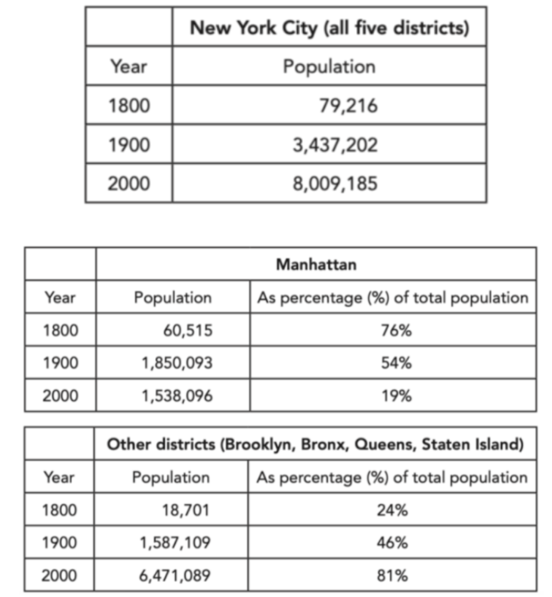
    
    The first table given demonstrates how the population in New York City has changed between the period of 1800 and 2000, and the second and third tables illustrate how the populations of five districts in the city have altered as a percentage of the entire population throughout this period.
    
    Overall, the total population of New York City has grown significantly from 1800 to 2000. As regards the changes in population in the five districts, Manhattan's population has fallen in proportion to the entire population in response to the growth in the ratio of the four other districts (Brooklyn, Bronx, Queens, and Staten Island).
    
    The population in New York City has grown from a little under 80,000 to 8 million in 200 years. Manhattan used to be the most populated district of the city, whose residents took up 76% of the entire city's population in 1800. Although Manhattan's population tripled in the next hundred years, its percentage of the city's population fell, as population in other districts also dramatically increased between 1800 and 1900. In 1900, Manhattan and other districts were nearly one-to-one. In 2000, Manhattan's percentage dropped to below 20% as its number of residents also fell significantly. By contrast, the number of people residing in other districts continued to climb in 2000, and the population in other districts finally comprised 81% of the entire city's population.
    
    **构成、占比：comprise = make up, account for, constitute, represent**
    
    **展示：show = illustrate, present, display, demonstrate**
    
    **变化：change = alter, shift, transform**
    
    **居民数：the most populated, the number of residents, the number of people residing in…**
    
- C20 Test2 地图
    
    The plans below show the site of a farm in 1950 and the same site today.
    
    Summarise the information by selecting and reporting the main features, and make comparisons where relevant.
    
    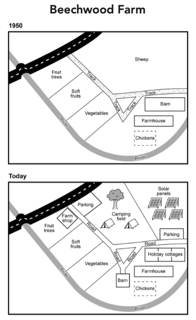
    
    The two maps illustrate how Beechwood Farm has changed from 1950 to the present day.
    
    In 1950, a track ran through the middle of the farm. To the north of the track was a large field for sheep, while the southern part of the farm contained most of the facilities. Fruit trees were located close to the main road, followed by areas for soft fruits and vegetables extending towards the river. Further away from the main road stood a barn, a farmhouse, and an enclosed area for chickens, all surrounded by the river on one side.
    
    Today, the track has been converted into a road, and the area once used for sheep has been replaced by a camping field, solar panels, and two parking areas. The barn has been relocated to the junction of two roads, with holiday cottages built on its former site. Additionally, a farm shop has been constructed among the fruit trees. In contrast, the farmhouse and the chicken enclosure have remained largely unchanged.
    
    Overall, Beechwood Farm has undergone significant development and modernization, with the addition of various new facilities, while the main road and the river have stayed the same.
    
    记忆描述位于和描述转变的表述
    
    位于：contained, located, extending, stood, surrounded by
    转变：has been converted into, has been replaced by, has been relocated to, has been construted among
    
    不变：have remained unchanged, have stayed the same
    
- C20 Test3 混合图
    
    The charts below give information about a public library in a town called Little Chalfont.
    
    Summarise the information by selecting and reporting the main features, and make comparisons where relevant.
    
    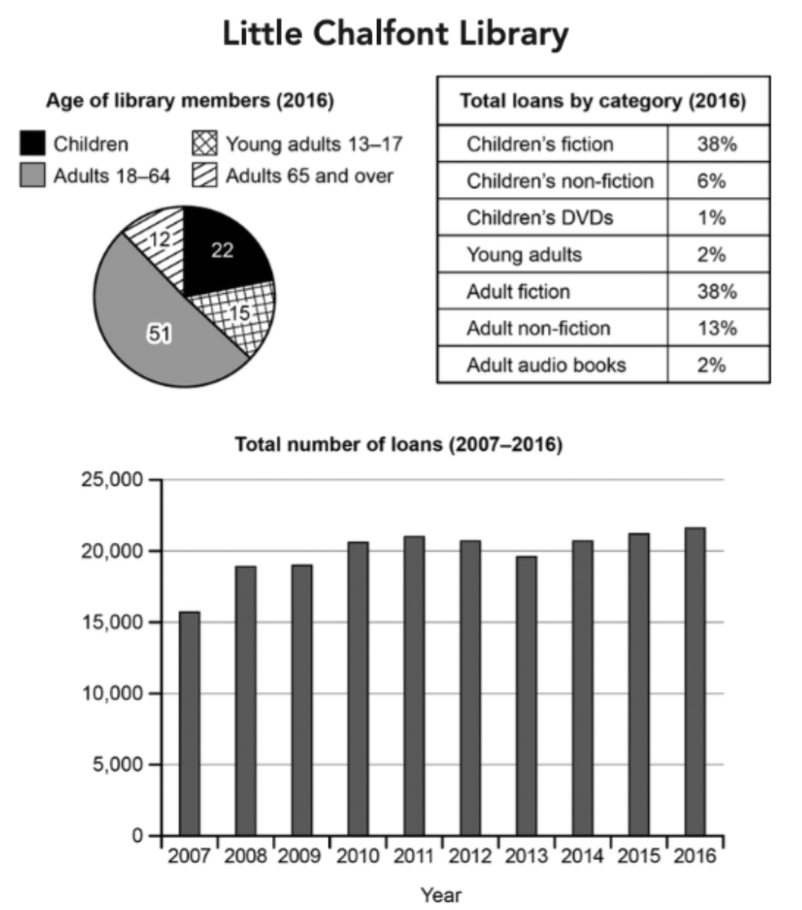
    
    The charts provide information about library members and loans in a town public library in Little Chalfont.
    
    Overall, adults aged 18-64 made up the largest proportion of the library members, and fiction was the most borrowed category. Although the total number of loans generally showed an increasing trend over the period of 2007 to 2016, there were some fluctuations.
    
    According to the charts, adults 18-64 account for the largest proportion of library members, making up 51% of the total. Children come second, accounting for around 22%, while young adults aged 13-17 represent approximately 15%. The smallest group is adults 65 and over, who comprise just 12% of the total members.
    
    In 2016, both children's fiction and adult fiction were the most borrowed categories in the library, each contributing 38% to the total number of loans. In stark contrast, children's DVDs were the least popular, accounting for only 1% of all loans. Between 2007 and 2011, the total number of loans experienced a steady increase from almost 15000 to over 20000. However, from 2011 to 2013, **this upward trend was interrupted by a moderate drop** to just below 20000. Despite this temporary decline, the total loans began to climb again from 2013 onwards, showing a gradual recovery towards 2016. 
    
- C20 Test4 流程图
    
    The diagram below shows how fabric is manufactured from bamboo.
    
    Summarise the information by selecting and reporting the main features, and make comparisons where relevant.
    
    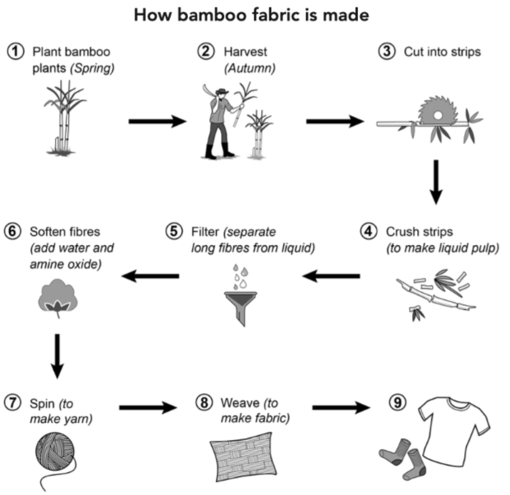
    
    The diagram given illustrates the process of producing fabric from bamboo.
    
    Overall, there are eight stages in the process, beginning with planting the bamboo in spring and harvesting it in autumn, and ending with weaving it to produce fabric, which can be made into clothes.
    
    First, bamboo plants need to be planted in the spring. In autumn, the grown bamboo would be harvested by farmers and cut into strips by a special machine. The strips are then crushed to make liquid pulp. In the next stage, the liquid pulp needs to be filtered to separate any long fibres from the liquid, which is a crucial stage in the production of bamboo fabric. When this is done, the fibres are softened by a mixture of water and amine oxide. A spinning process comes next to make yarn, and finally, the yarn is woven into fabric, which can be used for manufacturing clothes.
    
    注意顺序关系词
    
- C19 Test1 曲线图
    
    The graph below gives information on the number of participants for different activities at one social centre in Melbourne, Australia, for the period 2000 to 2020.
    
    Summarise the information by selecting and reporting the main features, and make comparisons where relevant.
    
    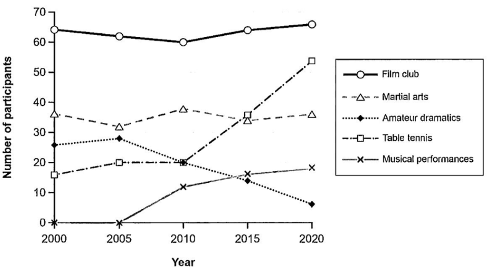
    
    The line graph illustrates the number of people participating in various activities - film club, martial arts, amateur dramatics, table tennis, and musical performances during the period from 2000 to 2020 at a social centre in Melbourne.
    
    It is noticeable that the number of participants in the film club was by far the highest over the period shown. In addition, players in table tennis saw the most significant rise in number, while there was an opposite trend in amateur dramatics.
    
    The number of participants in the film club was the highest, ending at almost 65 in 2020, although it went up and down between 60 and 65 during the period. A similar pattern was observed for martial arts, which ended at approximately 35 in 2020, with negligible fluctuation from about 32 to 35.
    
    The number of players in table tennis increased from about 15 in 2000 to 20 in 2005, remained unchanged until 2010, and then soared to over 50 in 2020. There was a similar trend in musical performances, which had no players until 2005, and grew rapidly to 15 in 2020. In contrast, the number of players in amateur dramatics climbed to less than 30 in 2005 before declining sharply to almost 5 in 2020.
    
- C19 Test2 地图
    
    The plans below show a harbour in 2000 and how it looks today.
    
    Summarise the information by selecting and reporting the main features, and make comparisons where relevant.
    
    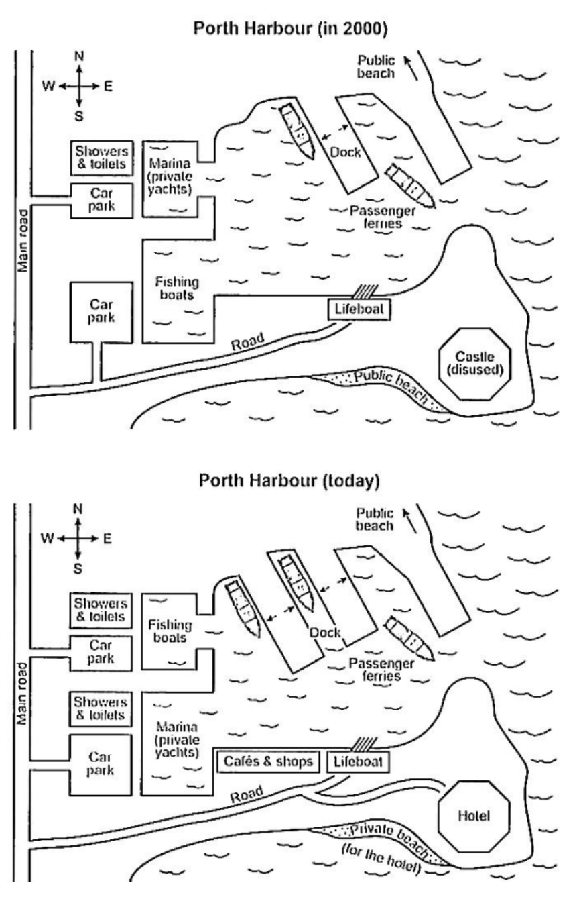
    
    The two maps illustrate the changes in Porth Harbour, comparing its layout in the year 2000 to its current state.
    
    In 2000, the harbour was situated along the main road, with two western parking lots connecting different roads. Utilized for basic amenities and areas for fishing boats and private yachts, Porth Harbour had two public beaches on the east side. The northern beach was adjacent to a dock where passenger ferries stopped, while the southern beach was near a disused castle and lifeboat station.
    
    In stark contrast, the present-day harbour has seen notable development, particularly in its commercial and recreational facilities. On the west side, both parking lots are accessible from the main road, and additional showers and toilets have been built between them. Adjacent to them, the area for marinas and fishing boats has been repositioned. With the construction of cafes and shops near the lifeboat station, the southern coast now features a new bypass leading to a newly built hotel, which has acquired the southern beach for commercial use, replacing the castle. Furthermore, a new dock has been built next to the existing one, enhancing the harbour’s capability.
    
    Overall, Porth Harbour has experienced significant development over the past two decades, evident in its expanded commercial facilities for tourists. There has also been an alteration in the utilization of different areas, as the southern part is now used privately.
    
- C19 Test3 流程图
    
    The diagram below shows how a biofuel called ethanol is produced.
    
    Summarise the information by selecting and reporting the main features, and make comparisons where relevant.
    
    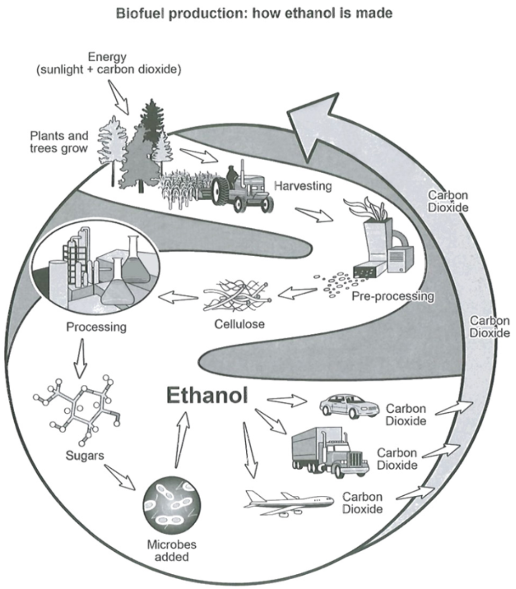
    
    The given flow chart depicts the production cycle of ethanol, a biofuel.
    
    Overall, this production process encompasses eight stages, which start with the cultivation of plants and trees and culminate in the supply of the generated ethanol to vehicles. Notably, the carbon dioxide released by the traffic can be utilised to promote the growth of the plants, effectively closing the whole cycle.
    
    Initially, sunlight and carbon dioxide serve as the primary energy sources for the growth of cultivated trees and plants. Upon reaching maturity, these plants are harvested using professional agricultural machinery and then pre-processed to produce cellulose.
    
    The remaining steps mainly involve the raw cellulose, through a series of transformations, is extracted to generate sugars that are subsequently fermented by the addition of microbes, yielding ethanol. Afterwards, this produced bio-energy will be used to power vehicles, including cars, planes, and trucks. The carbon dioxide released during the combustion of ethanol is then absorbed by the plants, completing the cycle.
    
    **成熟：mature v. 成熟 adj. 成熟的, maturity n. 成熟，成年, immaturity n. 不成熟，幼稚**
    
- C19 Test4 混合图
    
    The charts below give information on the location and types of dance classes young people in a town in Australia are currently attending.
    
    Summarise the information by selecting and reporting the main features, and make comparisons where relevant.
    
    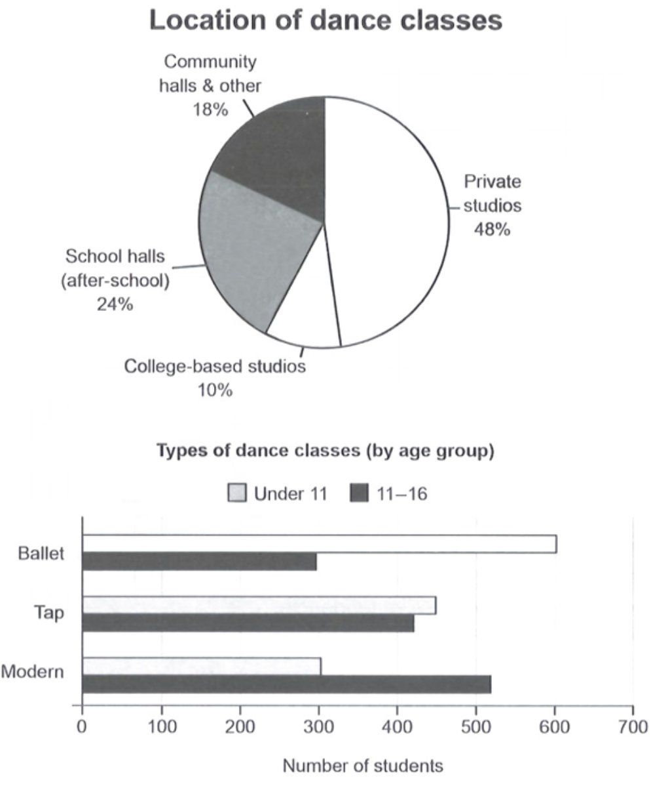
    
    The provided pie chart illuminates various locations where young people in an Australian town attend dance classes, and the bar graph categorizes types of dance classes they are enrolled in, classified by age groups.
    
    Overall, private studios are the primary location for dance classes. Ballet is notably more popular among younger children; nevertheless, modern dance attracts a larger number of teenagers.
    
    From the pie chart, it is evident that private studios host the largest proportion, comprising 48% of the total. School halls, especially for after-school programs, take the second most common location at 24% compared with 18% in community halls and other venues. Whereas college-based studios are the least utilized by young people, accounting for only 10%.
    
    According to the bar graph, ballet emerges as the most favored among children under 11, attracting about 600 students, compared to roughly 300 students aged 11-16. Modern dance, however, is chiefly attended by the older age group, with about 500 students aged 11-16, while interest drops significantly in the younger group, who number approximately 300. Tap dance exhibits a more balanced distribution, with nearly 430 students under 11 and around 450 students aged 11-16.